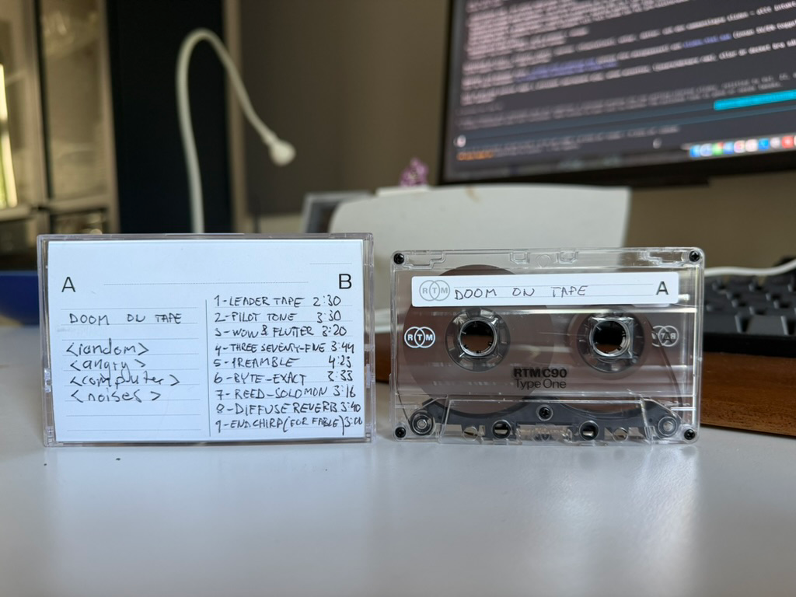

# cassette-ai

Can you store data — eventually a tiny LLM — on a normal audio cassette? Yes. This repo
took it all the way to the physical loop: **a real C90 cassette that holds DOOM and reads
itself back, byte-for-byte, through the air.**



**▶ Play the build that came off the tape, in your browser: https://magnus-gille.github.io/cassette-ai/**
&nbsp;·&nbsp; **Download the tape audio** (play it into your own deck, or decode it): [side A + B FLAC](https://github.com/Magnus-Gille/cassette-ai/releases/tag/doom-tape-v3-audio)

## TL;DR

- **🏆 The loop is closed (2026-06-13):** Freedoom Episode 1 — all 9 maps + WebAudio
  sound + a custom hand-built level — was recorded to a real C90, played back over a deck
  speaker into a phone mic, and decoded **byte-exact**: `0/9225` codewords failed, sha256
  matches the original. The HTML off the tape is identical to the file that went on.
- **🏆 Rate record: 5791 bps byte-exact on real tape** (×6.2 from the 934 bps starting
  point), via a resampling-PLL front-end + ensemble-union + carrier-class erasure rescue.
- **Capacity (real, byte-exact at the proven rate):** C60 side ≈ 1.24 MB · C90 side ≈
  1.86 MB · whole C90 ≈ 3.73 MB.
- **Codec lineage:** a BFSK/CAS3 codec (`src/cassette_format.py`) was the starting point;
  the shipping high-rate modem is the d2x config (`P21 N256, RS159`, net 4910 bps) decoded
  by the composed `m10/x11` superset receiver.

> ℹ️ **Verified on one setup so far** — my own cassette deck, tape stock, and capture chain.
> The DSP is deck-agnostic in principle, but the exact rates/levels haven't been reproduced on
> other hardware yet. **TODO: try it on other cassette decks / setups** and report back.

The early digital-sprint verdict ("a full LLM didn't clear the bar in corrected-channel
simulation") has been **superseded** by the physical results above. See `STATUS.md` for the
full arc: `934 → 2572 → 2896 → 5791 bps`, a hand-built DOOM level, a 9-track album made from
the data signal, and a cassette that holds DOOM and reads itself back.

## 📼 DOOM on a cassette

`experiments/tape_v2/doom_ship/` is the ship pipeline. Side A carries the full game; side B
carries a "DECODED" album built from the data signal, followed by the GPL source.

```
# Burn side A (DOOM) — full Episode 1 + sound + saves + The Magnetic Vault, ~41.7 min on a C90
bash experiments/tape_v2/doom_ship/play_doom_tape_v3.sh

# Burn side B — the DECODED album, then GPL source
bash experiments/tape_v2/doom_ship/play_doom_tape_sideb.sh

# Decode a readback capture → expect 0 codeword failures + sha256 match
python3 experiments/tape_v2/doom_ship/m10doom3_decode.py <capture.wav>
```

Proof of the real-tape decode: `experiments/tape_v2/doom_ship/results/m10doom3_results_doom_tape_readback.json`.

## 🎵 The B-side soundtrack — "DECODED"

Side B isn't filler — it's the project turned into music. **"DECODED" is a 9-track,
~31-minute album in which every single sound is derived from the actual signal the cassette
makes while data is being written to it** — the hiss, the tones, the little machine noises —
reshaped into songs. No outside samples. Each title names a real piece of the
data-transfer process, so the tracklist doubles as a plain-language tour of how the modem
works:

| # | Title | What it's named after |
|---|---|---|
| 1 | **Leader Tape** | the clear blank plastic before the magnetic tape starts — the "press play and wait" hiss |
| 2 | **Pilot Tone** | the one steady reference tone the decoder locks onto, like a singer humming the starting note |
| 3 | **Wow & Flutter** | the engineer's terms for a tape player's slow/fast speed wobble — here the flaw becomes the feel |
| 4 | **Three Seventy-Five** | the 375 Hz spacing between data tones, which falls almost on a musical scale — the hidden melody inside the numbers |
| 5 | **Preamble** | the "get ready" burst before each data chunk — a drummer's count-in, turned into the beat |
| 6 | **Byte-Exact** | the whole point: the data returns perfect, not one bit wrong — the victory song |
| 7 | **Reed-Solomon** | the error-correction math (Reed & Solomon) that rebuilds damaged data — the track reassembles itself |
| 8 | **Diffuse Reverb** | the wash of room echo — the spacious track, raw signal rising out of the haze |
| 9 | **End Chirp (for Fable)** | the closing sweep that says "data's done," slowed and gentle — dedicated to Fable, the AI that helped chart the project |

Full liner notes: `experiments/tape_v2/bside_remix/sideB/LINER_NOTES.md`.

## Capturing a tape playback (the proven path)

Don't live-capture the mic on the Mac — the sample clock jitters and decode fails. Instead:

1. Record the deck's playback **on an iPhone in Voice Memos, set to Lossless** (Settings →
   Voice Memos → Audio Quality → Lossless). The phone's ADC clock is sample-accurate.
2. It auto-syncs via iCloud to the Mac at
   `~/Library/Group Containers/group.com.apple.VoiceMemos.shared/Recordings/`.
3. Convert + analyze:
   ```
   ffmpeg -hide_banner -loglevel error -y -i <file>.qta -ac 1 -ar 48000 capture.wav
   python3 experiments/tape_v2/analyze_master2.py capture.wav
   ```

> **Use lossless capture — it is preferred, not optional, for the dense high-rate configs.**
> Voice Memos' default **AAC (lossy)** compression adds a frame-dependent nonlinearity that
> smears the tightly-packed carriers: in our calibrated head-to-head the dense PHYs are
> *byte-exact on a clean tape path but only marginal through AAC* (one bad seed at the edge
> of the RS budget). **Lossless (ALAC) removes that variable entirely.** The first
> validated copy of the DOOM tape was read back exactly this way — iPhone Voice Memos in
> Lossless mode → iCloud `.qta`/ALAC → `ffmpeg` to 48 kHz mono WAV → `m10doom3_decode.py`,
> giving `0/9225` codeword failures and a matching sha256. (Details:
> `experiments/tape_v2/REAL_DECODE_FINDINGS.md`.)

**Record/playback principles** (the numbers depend on your deck — tune them in):
Dolby NR **off** at both ends (companding mangles the multitone signal) · record at a
healthy level but **below saturation** — too hot blooms the intermodulation floor and kills
the dense carriers · leave **~1 s of silence around the start/end chirps** (they are the
sync anchors; if clipped, alignment fails). My own deck's exact settings are in `CLAUDE.md`.

## The original end-to-end tape test (software-validated)

The early proof-of-concept lives in `tests/e2e/` — encode a short message → tape → decode →
byte-compare, built on a robust front-end that survives silence offsets, gain/DC, resampling,
and deck-speed error.

```
python3 tests/e2e/loopback_selftest.py        # validate the whole chain through the sim (no tape)
```

Runbook for a physical run: [`tests/e2e/README.md`](tests/e2e/README.md).

## Plans ahead — for the world record

Everything above was done over an **acoustic** loop (deck speaker → air → phone mic), which
is the *hard* path: room reverb and a summed mono channel cap the rate. The next phase goes
after the outright **world-best data rate off a cassette**, on two fronts:

1. **Validate the cable (electrical line-in) path.** Replace the speaker-and-mic air gap
   with a direct electrical connection — deck line-out → a USB audio interface (e.g.
   Behringer UCA222) → the Mac. This removes reverb/ISI entirely and **unlocks true stereo
   (2× capacity)** — the acoustic loop sums both speakers into one mic, so stereo is
   electrical-only. The dense OFDM / bit-loaded configs that the modeling says should fly
   have been gated *out* on the acoustic channel; the cable run is where we expect them to
   finally clear.
2. **Push the rate past the acoustic ceiling.** The acoustic geometry topped out at the
   **5791 bps** record; the receiver loop has *converged* for that channel, so the next bits
   must come from the better physical link. Pre-registered leads waiting on the cable path:
   the killed `>4910` frontier designs re-gated against the cleaner channel, `RS223/5247` +
   DBPSK extended-band, and the **bulk-framing** campaign (~1.4× on everything — longer
   frames, since the PLL holds lock 520+ frames).

3. **Reproduce on other decks.** Every result so far is on a single setup (my deck + tape +
   capture chain). Running the master ladder on other cassette decks would show how
   deck-agnostic the rates really are, and surface per-deck tuning. Contributions welcome.

**Target:** the cable path + stereo + the frontier modems, characterized and decoded
byte-exact, to claim the **highest reliable data rate ever read back off a standard audio
cassette.** Track progress in `STATUS.md`.

## Setup

```
python3 -m pip install numpy scipy soundfile reedsolo matplotlib   # core
# ffmpeg required for capture/convert (brew install ffmpeg)
```

Python 3.11+. Research pipelines additionally use `transformers` / `torch`; HuggingFace
models cache in `hf_cache/` (gitignored). Big WAVs are gitignored and regenerable from scripts.

## Layout

| Path | What |
|---|---|
| `src/` | the codec, channel model, and the frozen evaluation harness (`hyp_common.py`) |
| `experiments/tape_v2/` | the physical tape test — master ladders, analyzer, rate campaigns (`x10`–`x12`, `m10`) |
| `experiments/tape_v2/doom_ship/` | **DOOM-on-cassette** ship pipeline (burn + decode + proofs) |
| `experiments/tape_v2/bside_remix/sideB/` | "DECODED" — the 9-track B-side album built from the data signal |
| `experiments/capacity/` | the 5-hypothesis capacity-pushing campaign (Gray, k-of-M, soft-FEC, bit-loaded OFDM, FTN) |
| `experiments/dpd/` | real-tape channel characterization + the cassette-LLM proof |
| `payloads/` | candidate tape payloads (tiny permissive LLMs + DOOM) |
| `app/` | the CassetteAI iOS companion app (capture, decode UX, setup grading) |
| `tests/e2e/` | the original end-to-end tape test (encode/decode CLIs, self-test, runbook) |
| `docs/` | CAS3 spec, capacity adjudication, `audio_magic_{deep,overview}.html` writeups |
| `STATUS.md`, `REPORT*.md`, `CLAUDE.md` | sprint status, findings, conventions |

## License

The original work here — the cassette modem, DSP, analysis, scripts, and the "DECODED"
album — is **MIT** licensed ([`LICENSE`](LICENSE)). The repo also bundles third-party
components under their own terms: the **doomgeneric / DOOM engine is GPL-2.0** (its source
ships on side B and as `payloads/doom/dist/doom_v3_source.tar`) and **Freedoom's assets are
BSD-3-Clause**. Full inventory and obligations: [`THIRD-PARTY-LICENSES.md`](THIRD-PARTY-LICENSES.md).
