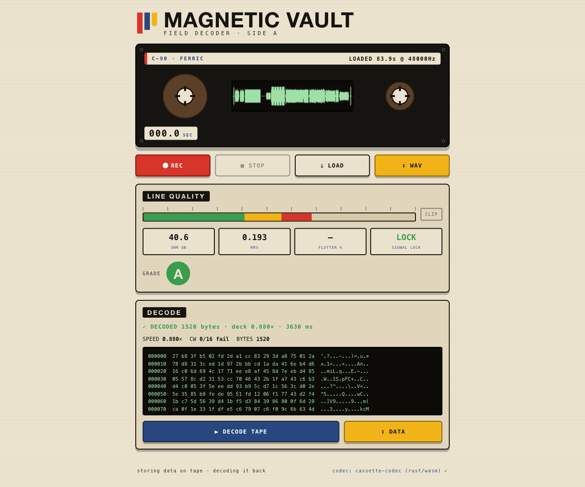

# Magnetic Vault — Field Decoder (companion app)



A small **installable web app (PWA)** that:

1. **Records lossless audio** — raw 32-bit float PCM straight off an `AudioWorklet`
   (sample-accurate; this is the clean clock the project's capture notes fought for),
   exportable as a 32-bit float WAV.
2. **Shows live line quality** — VU level, clip LED, a broadband SNR estimate, a
   sync-chirp **SIGNAL LOCK** strength, and an A–F grade for the take.
3. **Decodes a cassette data tape back to bytes** — entirely on-device via the
   WASM build of the pure-Rust [`cassette-codec`](../rust/cassette-codec) core
   (the R-1 combinatorial-MFSK floor rung: global chirp sync → resample → flutter-
   tracked non-coherent demod → RS(255,k) de-interleave). No server, no Python.

Why a PWA and not a native iOS app: it runs on the **phone browser and the desktop
from one codebase**, installs to the home screen, works offline, and — crucially —
reuses the exact same Rust decoder as everything else via WASM. (sagascript, the
desktop transcriber, is Tauri/desktop-only and has no iOS target, so it can't host
the "phone" half; this can.)

## Run it

```bash
# from the repo root — must be served over http(s); file:// won't allow modules/mic
cd companion
python3 -m http.server 8000
# then open http://localhost:8000/  (localhost counts as a secure context)
```

- **REC / STOP** — record a tape playback (mic or line-in). Lossless.
- **LOAD** — decode an existing recording (`.wav`, `.qta` Voice Memo, etc.).
- **DECODE TAPE** — run the on-device decoder over the current take.
- **↧ WAV** — download the lossless capture. **↧ DATA** — download the decoded bytes.

## Build / rebuild the decoder (WASM)

```bash
cd rust/cassette-codec-wasm
wasm-pack build --target web --release --out-dir ../../companion/pkg
```

The app degrades gracefully: if `pkg/` is absent, record + quality still work and
decode is disabled with a clear badge.

## The bundled tape

`floor_manifest.json` describes the R-1 floor rung of the shipped full-spectrum
test tape (chirp positions, frame layout, RS/interleave params). It's passed to
the decoder at call time, so pointing the app at a different tape is just a matter
of swapping that JSON — the WASM core is tape-agnostic.

## What's proven

The Rust core decodes the floor payload **byte-exact** from a raw capture across
the clean / normal / worn+−0.12 cassette channels (the worn channel is the exact
model that recovered data byte-exact off a physical cassette). See
`rust/cassette-codec/tests/floor_parity.rs`.

## Not yet (v2)

- Full sounder report card (flutter %, per-band SNR, IMD) — currently the quality
  panel shows live level/clip/SNR/lock; flutter is a placeholder.
- On-device **record → decode in one tap** (today: record, then decode).
- Higher rungs (DQPSK/OFDM) — only the robust floor rung is ported so far.
